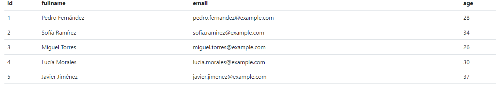
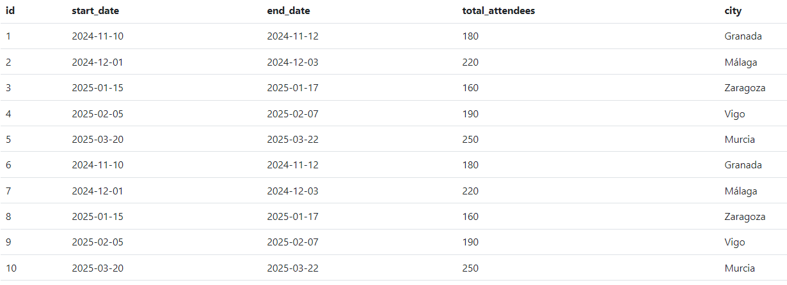
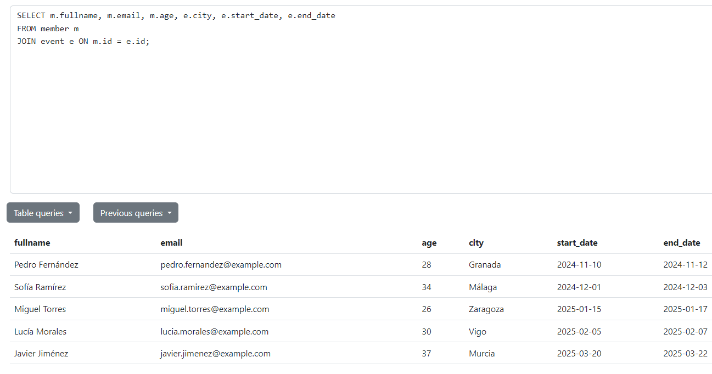
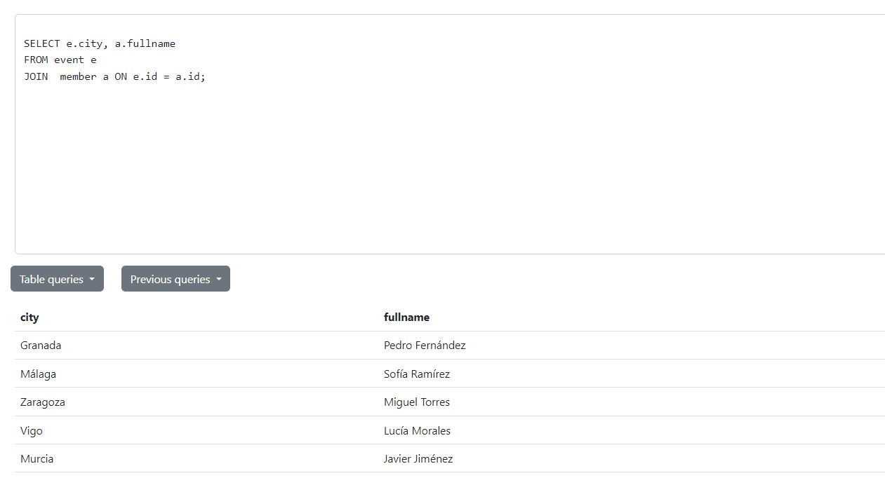

SUBCONSULTAS
Generar dos sentencias con subsconsultas en la base de datos EVENT.
Identificar claramente las sentencias que extraiga informacion valiosa para el contexto de la base de datos.
Desarrollar los ejercicios en fomato markdow (descripción de la sentencia, código, captura).
Exponer la solución.

Tablas:
Miembros:

Eventos:

Subconsulta 1:

Subconsulta 2:
